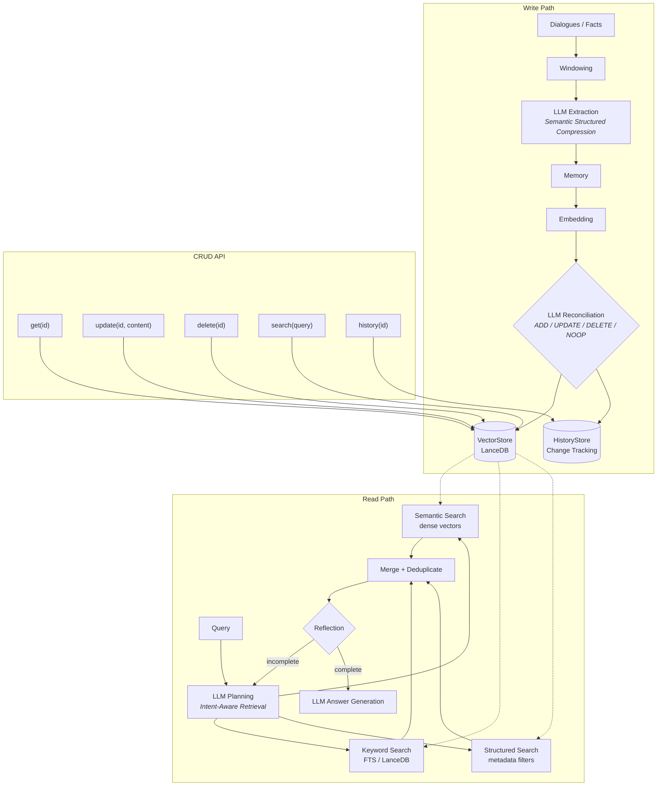

<!-- markdownlint-disable MD033 MD041 MD036 -->

# MEME

[![Crates.io][meme-crate]][meme-crate-url]
[![Documentation][meme-doc]][meme-doc-url]
[![CI][ci-badge]][ci-url]
[![License][license-badge]][license-url]
[![Rust][rust-badge]][rust-url]

[meme-crate]: https://img.shields.io/crates/v/meme.svg
[meme-crate-url]: https://crates.io/crates/meme
[meme-doc]: https://img.shields.io/docsrs/meme.svg
[meme-doc-url]: https://docs.rs/meme
[ci-badge]: https://github.com/qntx/meme/actions/workflows/rust.yml/badge.svg
[ci-url]: https://github.com/qntx/meme/actions/workflows/rust.yml
[license-badge]: https://img.shields.io/badge/license-MIT%2FApache--2.0-blue.svg
[license-url]: LICENSE-MIT
[rust-badge]: https://img.shields.io/badge/rust-edition%202024-orange.svg
[rust-url]: https://doc.rust-lang.org/edition-guide/

**High-performance long-term memory for AI agents — production-grade pipeline with semantic compression, lifecycle reconciliation, full CRUD, hybrid retrieval, and persistent vector storage, written in Rust.**

meme implements a production-grade memory pipeline with a Rust core: (1) **Semantic Structured Compression** extracts lossless, disambiguated memory entries from dialogues or raw facts via LLM, (2) **Lifecycle Reconciliation** deduplicates and manages ADD/UPDATE/DELETE/NOOP via LLM-driven conflict resolution at write time, and (3) **Intent-Aware Retrieval Planning** combines semantic, lexical (FTS), and structured metadata search with LLM-driven reflection. Memory is stored persistently on disk via LanceDB with full change history tracking.

## Quick Start

### Install the CLI

**Shell** (macOS / Linux):

```sh
curl -fsSL https://sh.qntx.org/meme | sh
```

**PowerShell** (Windows):

```powershell
irm https://sh.qntx.org/meme/ps | iex
```

### CLI

```bash
# Initialize configuration
meme init

# Add dialogues
meme add -s Alice "I'll be in Tokyo next Monday for the conference."
meme add -s Bob "Let's meet at Shibuya station at 3pm."

# Add raw facts (no speaker needed)
meme add "Alice prefers coffee over tea"

# Import from JSONL file
meme add --file conversation.jsonl

# Ask questions
meme ask "Where will Alice and Bob meet?"

# Semantic search
meme search "Alice travel plans"

# CRUD operations
meme get <uuid>
meme update <uuid> "Updated content here"
meme delete <uuid>

# View change history
meme history <uuid>

# List / count / clear
meme list
meme list --json --limit 50
meme count
meme clear

# Consolidate memories (decay, merge, prune)
meme consolidate

# Show effective configuration
meme config

# Export / import
meme export -o memories.json
meme import memories.json

# Namespace isolation (global flag, works with any command)
meme -n alice add -s Alice "I prefer coffee."
meme -n alice search "coffee"
```

### Library

```rust
use meme::{Dialogue, Meme};

let meme = Meme::builder()
    .api_key("sk-...")
    .model("gpt-4.1-mini")
    .build()
    .await?;

// Ingest a conversation — automatically extracted into structured memories.
meme.add(&[
    Dialogue::new("Alice", "Let's meet at 2pm tomorrow"),
    Dialogue::new("Bob", "Sure, I'll bring the Q3 report"),
]).await?;
meme.flush().await?;

// Store a fact directly (bypasses dialogue windowing).
meme.put("Alice prefers coffee over tea").await?;

// Hybrid search & Q&A.
let results = meme.search("Alice meeting").await?;
let answer = meme.ask("When will Alice meet?").await?;

// CRUD.
let entry = meme.get(results[0].id).await?;
meme.update(results[0].id, "Alice prefers tea over coffee").await?;
meme.delete(results[0].id).await?;

// Audit trail.
let events = meme.history(results[0].id).await?;
```

See [`examples/basic.rs`](meme/examples/basic.rs) for a runnable demo.

## Feature Flags

| Feature | Default | Description |
| --- | --- | --- |
| `api-embedding` | **yes** | Remote OpenAI-compatible embedding API |
| `onnx` | no | Local ONNX embedding + reranker via [`fastembed`](https://github.com/Anush008/fastembed-rs) — auto-downloads models from Hugging Face Hub |

## Configuration

**No configuration file is required.** The library is configured entirely through a fluent builder:

```rust
use meme::Meme;

let meme = Meme::builder()
    .api_key("sk-...")
    .model("gpt-4.1-mini")
    .base_url("https://api.openai.com/v1")
    .namespace("alice")               // memory isolation
    .semantic_top_k(25)                // tune retrieval depth
    .enable_reflection(true)           // iterative completeness checking
    .reranker("BAAI/bge-reranker-v2-m3") // local cross-encoder reranker (onnx feature)
    .rerank_top_n(5)
    .build()
    .await?;
```

For file-based config (e.g. CLI), load a `Config` and override specific fields:

```rust
use meme::Meme;

let config: meme::config::Config = toml::from_str(&toml_content)?;
let meme = Meme::builder()
    .config(config)           // load from TOML
    .api_key("override-key")  // override specific fields
    .build()
    .await?;
```

The CLI tool (`meme-cli`) optionally reads `~/.meme/config.toml`. Environment variables override any file or default values:

| Env Var | Overrides | Default |
| --- | --- | --- |
| `MEME_LLM_API_KEY` | `llm.api_key` | *(required)* |
| `MEME_LLM_BASE_URL` | `llm.base_url` | `https://api.openai.com/v1` |
| `MEME_LLM_MODEL` | `llm.model` | `gpt-4.1-mini` |
| `MEME_EMBEDDING_PROVIDER` | `embedding.provider` | `api` |
| `MEME_EMBEDDING_MODEL` | `embedding.model` | `text-embedding-3-small` |
| `MEME_EMBEDDING_API_KEY` | `embedding.api_key` | *(falls back to LLM key)* |
| `MEME_EMBEDDING_BASE_URL` | `embedding.base_url` | *(falls back to LLM URL)* |
| `MEME_EMBEDDING_DIMENSION` | `embedding.dimension` | `1536` |

<details>
<summary><b>Full config.toml reference</b></summary>

```toml
[llm]
api_key = "sk-..."
base_url = "https://api.openai.com/v1"
model = "gpt-4.1-mini"
temperature = 0.1
max_retries = 3

[embedding]
provider = "api"                        # "api" or "onnx"
model = "text-embedding-3-small"        # API model name or fastembed model code
dimension = 1536                        # vector dimension (auto-detected for onnx)
# api_key = "sk-embed-..."             # optional: separate key for embedding API
# base_url = "https://api.cohere.com/v1" # optional: separate endpoint for embedding API

[store]
lancedb_path = ".meme/lancedb"           # CLI resolves to ~/.meme/lancedb
history_db_path = ".meme/history.db"       # CLI resolves to ~/.meme/history.db
table_name = "memories"

[pipeline]
window_size = 40                        # dialogues per extraction window
overlap_size = 2                        # overlap between consecutive windows
semantic_top_k = 25                     # max semantic search results
keyword_top_k = 5                       # max keyword search results
structured_top_k = 5                    # max structured search results
enable_planning = true                  # LLM-driven query analysis
enable_reflection = false               # iterative completeness checking (token-heavy)
max_reflection_rounds = 2
max_build_workers = 16                  # parallel extraction workers
max_retrieval_workers = 8               # parallel search workers
# custom_extraction_prompt = "..."      # override built-in extraction prompt
# custom_answer_prompt = "..."          # override built-in answer prompt
# reranker_model = "BAAI/bge-reranker-v2-m3"  # local cross-encoder reranker (onnx feature)
rerank_top_n = 10                       # results to keep after reranking
```

</details>

## Architecture



Each `Memory` is a self-contained, unambiguous unit of knowledge stored with three index layers:

| Index Layer | Type | Purpose | Implementation |
| --- | --- | --- | --- |
| **Semantic** | Dense vector | Conceptual similarity | 1536-d embeddings via OpenAI or local ONNX |
| **Lexical** | Inverted index | Exact term matching | LanceDB FTS + BM25-style keywords |
| **Symbolic** | Structured metadata | Filtered lookup | Timestamp, location, persons, entities, topic |

## Pipeline

### Stage 1: Semantic Structured Compression

Raw dialogues (or direct facts via `put()`) are split into overlapping windows and sent to an LLM. The LLM extracts **atomic, self-contained memory entries** — each entry is a complete, independent fact with all pronouns resolved and all timestamps converted to absolute ISO 8601 format.

Each entry contains:

- **Content** — complete, self-contained sentence (no pronouns, no relative time)
- **Keywords** — core terms for BM25-style lexical matching
- **Structured metadata** — ISO 8601 timestamp, location, person names, entity names, topic phrase

### Stage 2: Lifecycle Reconciliation

New entries are reconciled against existing memories in a single LLM call. For each new fact, the LLM decides:

| Action | When | Effect |
| --- | --- | --- |
| **ADD** | Genuinely new information | Store the new entry |
| **UPDATE** | Supersedes an existing memory | Delete old + store new |
| **DELETE** | Contradicts an existing memory | Remove the obsolete entry |
| **NOOP** | Duplicate of existing memory | Skip (no storage) |

All write operations are tracked in the `HistoryStore` for audit and debugging.

### Stage 3: Intent-Aware Retrieval Planning

A single LLM call analyzes the user's query and produces a **unified retrieval plan**:

1. **Query analysis** — extract keywords, person names, entities, time expressions, and question type
2. **Search planning** — generate 1–3 targeted search queries for semantic retrieval
3. **Information requirements** — identify what specific facts are needed for a complete answer

The plan drives **parallel execution** of all three search layers (semantic, keyword, structured). Results are merged via ID-based deduplication.

When reflection is enabled, the system iteratively assesses completeness: if retrieved context is insufficient, additional targeted queries are generated and executed until the information requirement is satisfied or the max reflection rounds are reached.

## Benchmark

`meme-bench` evaluates memory quality using the [LOCOMO](https://github.com/snap-stanford/locomo) benchmark format:

```bash
MEME_LLM_API_KEY=sk-... meme-bench run --dataset locomo10.json
meme-bench run --dataset data.json --model gpt-4.1-mini --output report.json
meme-bench sample -o sample_bench.json  # generate sample dataset
```

Metrics: token-level F1, precision, recall, exact match — per question category (single-hop, temporal, commonsense, open-domain, adversarial).

## License

Licensed under either of:

- Apache License, Version 2.0 ([LICENSE-APACHE](LICENSE-APACHE) or <https://www.apache.org/licenses/LICENSE-2.0>)
- MIT License ([LICENSE-MIT](LICENSE-MIT) or <https://opensource.org/licenses/MIT>)

at your option.

Unless you explicitly state otherwise, any contribution intentionally submitted for inclusion in this project shall be dual-licensed as above, without any additional terms or conditions.

---

<div align="center">

A **[QuantX](https://qntx.org)** open-source project.

<a href="https://qntx.org"></a>

Code is law. We write both.

</div>

